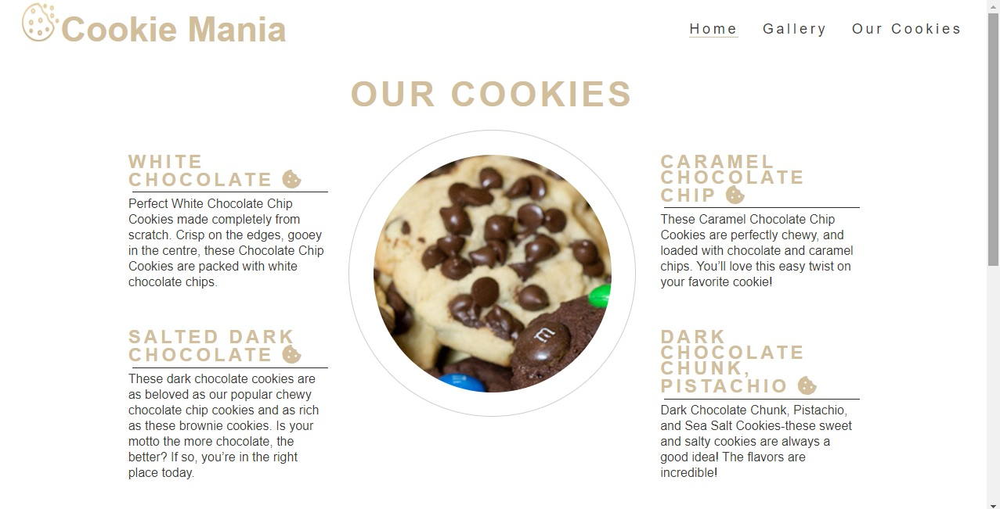

### Cookie Mania
A website for a Cookie shop based in France Paris and has a several branches all over the world, The website shows the type of cookies which we have and some information about how we started and the ingredients, The website is implementation for which I have learned (HTML/CSS).
And I have built this website to present it for the project 1.

## Installation:
Click on Gitpod green button.

## Using the project: 
The project has 3 pages.  Home, Gallery and Our Cookies page.
-	**Home page content:** 
1 – A big photo fade out on the top. 
2- A photo for Cookie Mania shop. 
3- A small paragraph about our *story* and how we began. 
4- Information about our branches all over the world. 
5- At the end our social media accounts links. 

-	**Gallery page content:** 
1-	A small gallery which shows the 4 types of our Cookies. 
2-	Navigation buttons allows the user to navigate between the images. 

-	**Our Cookies page content:** 
1-	An image in the middle shows a cookie. 
2-	Descriptions for the 4 types of Cookies which we serve. 

## Our accounts on social media:
  - [Twitter](https://twitter.com/)
 - [Instagram](https://www.instagram.com/)
 - [Facebook](https://www.facebook.com/)
## Screenshots: 

## Resources: 
https://hadi-darra.github.io/cookie-mania/
https://www.sweetestmenu.com/white-chocolate-chip-cookies/
https://sallysbakingaddiction.com/salted-dark-chocolate-cookies/
https://belleofthekitchen.com/caramel-chocolate-chip-cookies/
https://www.twopeasandtheirpod.com/dark-chocolate-chunk-pistachio-and-sea-salt-cookies/
https://lafabrique-cookies.fr/fr/content/14-tout-sur-le-cookie
https://thumbs.dreamstime.com/z/golden-bitten-cookie-icon-vector-illustration-181923478.jpg
https://codepen.io/ongtiffany/pen/PPbPyB
